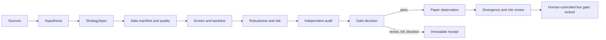

# The Pass

[](https://github.com/mightymattys/the-pass/actions/workflows/ci.yml)
[](https://github.com/mightymattys/the-pass/releases/latest)
[](pyproject.toml)
[](LICENSE)

**A review station for trading strategy research. Recipes in, evidence out.**

The Pass is an engine-neutral, plugin-first framework for testing trading strategies across
crypto, futures, prediction markets, and other market structures. It turns a trading idea into
a versioned research specification, reproducible experiment package, independent audit, and
artifact-backed promotion decision.

The project takes its operating model from a professional kitchen: research and implementation
can move quickly, but the person preparing an experiment does not grade their own plate. Runs are
preserved even when the result is `kill`, `revise`, or `blocked`.

> [!IMPORTANT]
> The Pass is not a trading bot, signal service, strategy library, or claim of profitability. The
> public repository cannot place real orders, load trading credentials, or approve live trading.

## Why The Pass Exists

Most backtests fail for reasons that are not visible in the headline Sharpe ratio: data leakage,
weak source evidence, multiple testing, optimistic fills, missing costs, unstable parameters, or
unreviewed operational risk. The Pass makes those failure modes explicit and machine-checkable.

- Formalize ideas as falsifiable, immutable `StrategySpec` versions.
- Preserve source provenance, data fingerprints, configuration hashes, and code versions.
- Validate chronology, data quality, execution assumptions, accounting, and costs.
- Run deterministic screens, event simulations, robustness tests, and risk reports.
- Separate experiment receipts from independent gate decisions.
- Reproduce evidence in a clean environment before promotion.
- Carry the same decision contract from replay into isolated paper observation.
- Produce read-only JSON, Markdown, and static HTML reports.

## Research Lifecycle



A valid run receipt proves that an experiment happened and that its artifacts are internally
consistent. It does **not** prove that a gate passed. Promotion requires a separate
`gate_decision` tied to the exact package, evidence fingerprints, reviewer, policy version, and
policy hash.

## Current Status

The framework is operational. All capability milestones in the machine-readable roadmap pass,
while candidate promotion remains deliberately separate.

The source tree and plugin manifests are versioned `0.10.0`; the latest published release remains
`v0.9.1` until the supervised-workflow release is tagged. The release badge above remains the
authority for the latest published tag. Readiness is recorded in the
[`v0.9.0` cross-agent audit](reports/CROSS_AGENT_ORCHESTRATION_AUDIT_0.9.0.md) and the
[full repository stability audit](reports/FULL_REPOSITORY_STABILITY_AUDIT_2026-07-10.md). Versioned
publication evidence for the installation fix is tracked in the
[`v0.9.1` release audit](reports/RELEASE_AUDIT_0.9.1.md) and
[post-release verification](reports/POST_RELEASE_AUDIT_0.9.1.md).
Post-release framework hardening and its exact verification matrix are recorded in the
[repository hardening audit](reports/REPOSITORY_HARDENING_AUDIT_2026-07-10.md); those unreleased
source changes do not alter the published tag or imply candidate promotion.

| Area | Framework capability | Bundled candidate state |
| --- | --- | --- |
| Research and schemas | Complete | Synthetic/public-safe evidence only |
| Canonical data and adapters | Complete | Venue-specific restrictions apply |
| Screen and backtest harness | Complete | No pre-approved profitable strategy |
| Robustness, risk, and audit | Complete | Promotion requires independent evidence |
| Paper, automation, and reporting | Complete | Included observation remains blocked |
| Live execution | Contracts defined | Technically locked and forbidden |

See the [machine-readable roadmap](docs/implementation/roadmap-status.yaml),
[completion audit](docs/implementation/COMPLETION_AUDIT.md),
[slash-skill consolidation audit](reports/SLASH_SKILL_CONSOLIDATION_AUDIT_2026-07-10.md), and
[full stability audit](reports/FULL_REPOSITORY_STABILITY_AUDIT_2026-07-10.md) for exact evidence
paths and current verification results.

## Quick Start

The Pass supports Python 3.9 and 3.12. [`uv`](https://docs.astral.sh/uv/) is the reference
development workflow.

```bash
git clone https://github.com/mightymattys/the-pass.git
cd the-pass
uv sync --locked --extra data --extra research
uv run the-pass --version
uv run python scripts/validate_public_repo.py
uv run python -m unittest discover -s tests -v
```

The base package only needs PyYAML and JSON Schema. Optional extras add:

| Extra | Adds |
| --- | --- |
| `data` | Arrow/Parquet, DuckDB, HTTP, and WebSocket support |
| `research` | NumPy, pandas, and SciPy |
| `paper` | No live client; kept intentionally dependency-light |
| `dev` | Ruff |

For wheel installation and clean-package verification, see
[Installation](docs/public/INSTALLATION.md). Packaged schemas and policies work without a source
checkout.

For the complete workflow from CLI/plugin installation through a real research run, independent
gate review, paper observation, external engines, and agent delegation, follow the
[Usage Guide](docs/public/USAGE_GUIDE.md).

## First Evidence Check

Validate the two public-safe packages, then write and verify an append-only ledger:

```bash
uv run the-pass validate-package examples/synthetic-breakout/package --format json
uv run the-pass validate-package examples/synthetic-random-baseline/package --format json

LEDGER="$(mktemp -d)/receipts.jsonl"
uv run the-pass receipts --ledger "$LEDGER" --format json add \
  examples/synthetic-breakout/package
uv run the-pass receipts --ledger "$LEDGER" --format json add \
  examples/synthetic-random-baseline/package
uv run the-pass receipts --ledger "$LEDGER" --format json verify
```

The breakout fixture demonstrates a complete package shape. The seeded random fixture
demonstrates that a valid experiment can and should be killed. Neither fixture is real trading
evidence.

## CLI

The CLI is the stable, scheduler-neutral interface for validation and reference workflows:

```bash
uv run the-pass --help
uv run the-pass <group> --help
```

| Group | Responsibility |
| --- | --- |
| `validate`, `validate-package` | Validate one artifact or a complete run package |
| `data`, `features` | Build canonical quality and deterministic feature evidence |
| `screen`, `backtest` | Run preregistered diagnostics and deterministic simulations |
| `robustness`, `risk` | Evaluate selection bias, stress, and independent risk policy |
| `gate` | Evaluate artifact-backed candidate gates |
| `paper` | Run an isolated virtual paper worker |
| `automation`, `incident` | Execute whitelisted jobs and create fail-closed incident evidence |
| `report`, `dashboard` | Build static, read-only evidence bundles |
| `receipts` | Append and semantically replay run and gate-decision ledgers |
| `workflow` | Start, advance, inspect, supervise, or supersede a bounded slash-skill run |
| `agents` | Route, inspect, or explicitly dispatch bounded Codex/Claude agent tasks |

All commands support `--format text|json`. Stable JSON responses contain `ok`, `status`,
`artifact_paths`, `issues`, and `receipt_id`. See the full [CLI contract](docs/public/CLI_CONTRACT.md).

### Exit Codes

| Code | Meaning |
| --- | --- |
| `0` | Operation succeeded or the evaluated gate passed |
| `1` | Invalid input, missing evidence, schema failure, or technical failure |
| `2` | Valid result was blocked, revised, killed, or frozen |
| `3` | Operation is forbidden by the public safety boundary |

Exit code `2` is a successful research evaluation, not a software crash. `live_gate` is locked
and returns `3` in the public implementation.

## Codex and Claude Code Plugins

The repository contains validated Codex and Claude Code plugin manifests backed by the same seven
focused slash-command skills. The plugins are guided research surfaces; the Python CLI remains the
machine interface and source of validation truth.

Install the Codex plugin from the pinned marketplace:

```bash
codex plugin marketplace add mightymattys/the-pass --ref v0.9.1
codex plugin add the-pass@the-pass-tools
```

For Claude Code, add `mightymattys/the-pass` as a marketplace and install
`the-pass@the-pass-tools`. Install the Python CLI separately in both cases; see the
[Usage Guide](docs/public/USAGE_GUIDE.md).

| Slash command | Purpose |
| --- | --- |
| `/the-pass:run` | Orchestrate the whole bounded line to one selected gate |
| `/the-pass:research` | Review sources, formalize a hypothesis, and create a StrategySpec |
| `/the-pass:test` | Run a diagnostic screen or reproducible backtest package |
| `/the-pass:review` | Independently review research, paper, or risk evidence |
| `/the-pass:paper` | Prepare and observe isolated replay/paper evidence |
| `/the-pass:plate` | Build the risk and approval package after paper passage |
| `/the-pass:status` | Summarize workflow state, receipts, blockers, and next action |

`/the-pass:run` is the default front door. It creates resumable state under
`.the-pass/runs/<run-id>/state.yaml`, invokes the focused skills in policy order, records
immutable evidence, and stops at `complete`, `waiting`, `blocked`, or `killed`. For example:

```text
/the-pass:run Test this momentum idea to research_gate
```

The orchestrator never treats a receipt as approval, never retries a gate decision, and cannot
target `live_gate`. Paper observation may correctly stop at `waiting` until its predeclared
window is complete.

The state machine is bounded: at most twenty work transitions, three remediation laps per gate,
and two consecutive no-progress remediation laps. Exhausted budgets cannot be resumed. A target
gate can enter remediation only from its exact package's recorded `blocked` or `revise` decision
when that decision fingerprints a confirmed finding. Claimed progress requires a newly recorded
successor package; editing counters, copying a package, or using a v1 row cannot advance the run.

### Supervised End-to-End Execution

Version `0.10.0` adds a mechanical liveness supervisor. It repeatedly executes exactly one stage,
reloads durable state, rejects no-progress or illegal transitions, and stops only at `complete`,
`waiting`, `blocked`, or `killed`. Inspect the next route without making a model call:

```bash
the-pass agents route --stage backtest --author-provider codex --format json
the-pass workflow execute --state .the-pass/runs/<run-id>/state.yaml \
  --author-provider codex --format json --driver auto
```

Add `--execute` before `--driver auto` to start paid/authenticated provider calls. The auto driver
uses the versioned stage policy: Claude is preferred for research and adversarial statistical
review, Codex for data, implementation, simulation, paper, and risk packaging, and an independent
provider for gate review. It selects the cheapest profile satisfying the stage's workload and
capability floor. Preflight and gate recording are deterministic and never ask a model to approve
itself.

The reviewed `0.10.0` catalog contains only GPT-5.6 Luna, Terra, and Sol for Codex, plus Claude
Sonnet 5, Opus 4.8, and Fable 5. Policy validation rejects a Codex model below GPT-5.6, more than
three provider models, and any model outside the current allowlist; there is no legacy fallback.

The auto driver is an explicitly trusted local mode: selected provider CLIs receive workspace
tools so they can produce evidence and run tests. The supervisor validates state and gate authority
after every turn, but it is not an OS sandbox for an arbitrary local command. A custom trusted
driver may replace `auto` after `--driver` when another orchestrator should own stage execution.
`agents doctor` does not verify authentication or model entitlement. Authenticate both providers
for the default route, or pass `--available-provider codex|claude`; provider failures are not
automatically retried through a second model.

The complete behavioral contract is in [The Pass Commands](docs/plugin/COMMANDS.md) and
[Skill Contracts](docs/implementation/SKILL_CONTRACTS.md). The consolidation rationale and
verified implementation plan are in the
[Slash Skill Consolidation Plan](docs/implementation/SLASH_SKILL_CONSOLIDATION_PLAN.md).

Claude Code also exposes four bounded native agents: `coordinator`, `researcher`, `implementer`,
and `reviewer`. Codex or Claude may delegate to the other provider through a provider-neutral,
depth-one broker. Delegation is inspect-first and never runs implicitly:

```bash
the-pass agents doctor --format json
the-pass agents route --stage review_research --author-provider codex --format json
the-pass agents inspect templates/agent_task.yaml --format json
the-pass agents dispatch templates/agent_task.yaml --output-dir reports/agents \
  --execute --format json
```

`AgentTask` selects a structured workload and minimum profile. The broker resolves `economy`,
`balanced`, or `deep` against the target provider's versioned capability catalog, applies role and
write-mode floors, and shows the exact requested model and effort in `agents inspect` before any
paid call. Arbitrary model IDs are not accepted from tasks.

Read-only tasks cannot write. Implementation tasks run in a disposable Git worktree and return an
unapplied patch for the caller to review. Agents cannot apply patches, write protected governance
paths, decide gates, approve live trading, recursively delegate, or retry a failed model call.
External provider calls are serialized; parallel work belongs inside bounded native subagents.
User/project MCP servers, plugins, hooks, and connector settings are disabled for broker-managed
provider processes. See
[Cross-Runtime Orchestration](docs/plugin/CROSS_RUNTIME.md).

## Evidence Model

Core v2 artifacts include:

- Research: source notes, research briefs, hypotheses, and strategy specifications.
- Data: instrument registries, canonical events, manifests, quality reports, and feature manifests.
- Experiments: screen reports, metrics, cost waterfalls, verdicts, and run receipts.
- Review: findings, audit reports, robustness results, risk policies, and risk reports.
- Operations: paper plans, observation manifests, divergence reports, automation runs, and incidents.
- Governance: gate decisions, approval packs, config diffs, dry-run proofs, and locked human decisions.

Schemas are registered by `(artifact_type, schema_version)`. V1 evidence remains readable for
compatibility, but cannot be treated as a passed v2 gate. Strategy specifications are immutable
after their first run; material changes create a new version and run.

The repository ships one latest-version template for each of its 37 registered artifact types.
Every template is validated in the public repository check through the production artifact
validator. Starter values are deliberately `draft`, `diagnostic`, `blocked`, or otherwise
non-promoting; they demonstrate a valid shape and must be replaced with measured evidence before
any candidate gate can pass.

Authoritative v2 lookups bind both the deterministic package ID and the resolved package path.
A run must be recorded before its gate decision, package IDs cannot be reused across paths, and
paper/risk progression uses `the-pass workflow supersede --ledger <ledger>` to prove exact
predecessor lineage. Every successor receives fresh prerequisite gate decisions.

Canonical candidate gates are:

1. `research_gate`
2. `paper_gate`
3. `risk_review`
4. `live_gate` (locked)

Gate policy is versioned under [`config/`](config/) and its exact hash is recorded in each
decision.

## Data and Adapter Boundaries

The common adapter protocol covers discovery, raw acquisition, normalization, cross-checking,
manifest creation, cost snapshots, replay metadata, timestamp quality, licensing, and maximum
promotion mode.

| Lane | Public capability | Boundary |
| --- | --- | --- |
| Binance Spot | Public REST data and read-only market WebSocket | Fill-sensitive work requires trade/book evidence and cross-source review |
| Polymarket | Public discovery, CLOB snapshots, market stream, dynamic fees, and resolution metadata | No order endpoint or authenticated user channel |
| Futures | Databento-compatible interface, contract definitions, sessions, rolls, and fixtures | Diagnostic-only without a user-supplied licensed archive |

Raw data is immutable, normalized data points back to raw fingerprints, and feature outputs
include code and configuration provenance. DuckDB is a local query layer, not the source of
truth. Paid data and provider credentials must never enter the repository, artifacts, or logs.

Read the [Adapter Contract](docs/adapter-contract.md) and
[Canonical Data Foundation](docs/adapters/DATA_FOUNDATION.md) before adding a provider.

## Execution, Statistics, and Risk

The reference simulator is intentionally small and auditable. It models order lifecycle,
partial fills, depth, fees, slippage, funding, borrow, rolls, missed fills, and portfolio
conservation. Mid-price fills are diagnostic-only and cannot support promotion.

Gross and net path metrics use separate equity curves. Annualization records the asset calendar,
median observation interval, and periods per year instead of assuming every market has 252 data
points per year. Missing prices, malformed fills, conflicting event identities, and stale/future
paper observations fail closed.

The robustness layer includes walk-forward evaluation, purged splits and embargoes, PBO,
PSR/DSR, deterministic bootstrap, Reality Check/SPA support, parameter sensitivity, regime
splits, and execution stress. Risk limits are strategy-independent; a strategy cannot rewrite
its own policy.

See [Backtest Harness](docs/implementation/BACKTEST_HARNESS.md) and
[Robustness, Risk, and Audit](docs/implementation/ROBUSTNESS_RISK_AUDIT.md).

## Paper, Automation, and Reports

Paper observation runs in a separate virtual process with no live trading client. It fails
closed on stale data, clock skew, outages, or risk breaches and records decisions, simulated
intents, fills, missed fills, latency, and divergence.

Automation is exposed as idempotent CLI jobs for cron, GitHub Actions, or an external
orchestrator. The project intentionally does not ship its own scheduler. Reports and dashboards
are static, read-only HTML bundles; they cannot alter gates, limits, strategy specs, or approval
state.

See [Paper, Automation, and Reporting](docs/implementation/PAPER_AUTOMATION_REPORTING.md).

## Repository Map

| Path | Contents |
| --- | --- |
| [`src/the_pass/`](src/the_pass/) | CLI, validation, data, adapters, engine, statistics, risk, paper, automation, and reporting |
| [`schemas/`](schemas/) | Public JSON Schemas and compatibility registry |
| [`templates/`](templates/) | Schema-valid, deliberately non-promoting starters for all 37 artifact types |
| [`research/`](research/) | Source registry and reviewed research evidence |
| [`examples/`](examples/) | Synthetic packages, adapters, baselines, and outcome examples |
| [`automations/`](automations/) | Scheduler-neutral job specifications |
| [`config/`](config/) | Versioned gate, risk, skill-pipeline, and agent/model-routing policies |
| [`docs/`](docs/) | Architecture, ADRs, contracts, plans, and public documentation |
| [`reports/`](reports/) | Capability gates, audits, benchmark evidence, and generated reports |
| [`tests/`](tests/) | Unit, contract, mutation, safety, and end-to-end tests |
| [`.codex-plugin/`](.codex-plugin/) | Codex plugin manifest |
| [`.claude-plugin/`](.claude-plugin/) | Claude Code plugin and marketplace manifests |
| [`agents/`](agents/) | Bounded Claude Code native subagent definitions |
| [`skills/`](skills/) | Slash-command skill implementations |

## Development

Keep changes scoped and preserve the fail-closed boundary.

```bash
uv lock --check
uv run ruff check .
uv run python scripts/validate_public_repo.py
claude plugin validate .claude-plugin/plugin.json --strict
claude plugin validate . --strict
uv run python -m unittest discover -s tests -v
DIST_DIR="$(mktemp -d)"
uv build --out-dir "$DIST_DIR"
uv run python scripts/validate_distribution.py "$DIST_DIR"/the_pass-*.whl
```

Default CI is fully offline and tests Python 3.9 and 3.12. Network adapter checks are explicit,
read-only workflows. The scheduled benchmark exercises deterministic matrices up to one million
events and archives the result for regression analysis.

Before contributing, read [CONTRIBUTING.md](CONTRIBUTING.md), the
[public release checklist](docs/public/RELEASE_CHECKLIST.md), and the
[schema compatibility policy](docs/public/SCHEMA_COMPATIBILITY.md).

## Safety and Security

Do not commit API keys, wallet keys, session tokens, paid data, private account details, real
fills, balances, order IDs, or proprietary outputs that are not intended to be public.

The public core defines only the contracts needed to reason about a future live boundary. It
contains no real order transport, authenticated order client, or credential loader. Any future
live capability requires a new venue-specific ADR, threat model, provider/legal review,
least-privilege credential boundary, dry-run proof, rollback plan, and explicit human decision.

Report vulnerabilities according to [SECURITY.md](SECURITY.md).

## Documentation

- [Main research plan](docs/research/the-pass-plan.md)
- [Trading roadmap execution plan](docs/implementation/TRADING_ROADMAP_EXECUTION_PLAN.md)
- [Artifact lifecycle](docs/implementation/ARTIFACT_LIFECYCLE.md)
- [Validation and safety](docs/implementation/VALIDATION_AND_SAFETY.md)
- [Plugin command contract](docs/plugin/COMMANDS.md)
- [Cross-runtime orchestration](docs/plugin/CROSS_RUNTIME.md)
- [Cross-agent implementation plan](docs/implementation/CROSS_AGENT_ORCHESTRATION_PLAN.md)
- [Portable orchestration ADR](docs/adr/ADR-0010-portable-agent-orchestration.md)
- [Capability-aware model routing ADR](docs/adr/ADR-0011-capability-aware-model-routing.md)
- [`v0.9.0` cross-agent audit](reports/CROSS_AGENT_ORCHESTRATION_AUDIT_0.9.0.md)
- [Full repository stability audit](reports/FULL_REPOSITORY_STABILITY_AUDIT_2026-07-10.md)
- [`v0.9.0` release notes](docs/public/RELEASE_NOTES_v0.9.0.md)
- [`v0.9.0` release audit](reports/RELEASE_AUDIT_0.9.0.md)
- [`v0.9.0` post-release verification](reports/POST_RELEASE_AUDIT_0.9.0.md)
- [`v0.9.1` release notes](docs/public/RELEASE_NOTES_v0.9.1.md)
- [`v0.9.1` release audit](reports/RELEASE_AUDIT_0.9.1.md)
- [`v0.9.1` post-release verification](reports/POST_RELEASE_AUDIT_0.9.1.md)
- [`v0.10.0` supervised workflow release notes](docs/public/RELEASE_NOTES_v0.10.0.md)
- [Supervised workflow implementation audit](reports/SUPERVISED_WORKFLOW_AUDIT_2026-07-11.md)
- [Repository hardening audit](reports/REPOSITORY_HARDENING_AUDIT_2026-07-10.md)
- [CLI contract](docs/public/CLI_CONTRACT.md)
- [Usage guide](docs/public/USAGE_GUIDE.md)
- [Release process](docs/public/RELEASE_PROCESS.md)
- [`v0.8.0` release audit](reports/RELEASE_AUDIT_0.8.0.md)
- [`v0.8.0` post-release verification](reports/POST_RELEASE_AUDIT_0.8.0.md)
- [Performance policy](docs/public/PERFORMANCE_POLICY.md)
- [Outcome examples](examples/outcomes/README.md)
- [Changelog](CHANGELOG.md)
- [Latest release](https://github.com/mightymattys/the-pass/releases/latest)

## License

[MIT](LICENSE)
