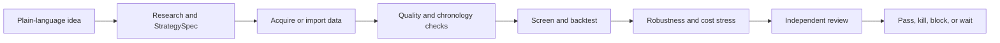

# Getting Started with The Pass

This is the shortest path from a trading idea to an auditable test. You do not need an existing
backtest, strategy implementation, or a folder of previous results.

## 1. What You Need

Required:

- a writable project folder;
- the `the-pass` CLI;
- Codex or Claude Code with the The Pass plugin for guided runs;
- a trading idea, even if it is still incomplete.

Not required to start:

- exchange credentials;
- an exchange account;
- historical results from another backtester;
- finished strategy code;
- live trading infrastructure.

> [!IMPORTANT]
> A backtest eventually needs historical **market data**. That is different from needing previous
> **backtest results**. The Pass can try supported public read-only sources, or you can supply your
> own market archive. It never fabricates missing history.

## 2. Where the Data Comes From

Choose the row that matches your situation:

| Starting point | Do you supply data? | What The Pass does |
| --- | --- | --- |
| Idea only, public market | Usually not at first | Researches the idea, attempts supported public acquisition, validates data, and runs the strongest test the evidence permits |
| Futures or licensed provider | Yes | Reads a user-supplied licensed archive through the provider interface; licensed data is never committed |
| Your CSV, Parquet, trades, or book archive | Yes | Requires or builds a scoped normalizer, then produces canonical events, a manifest, checksums, and a quality report |
| Existing external backtest | Supply results and provenance | Validates an exported evidence package; external results do not bypass costs, chronology, robustness, or review |
| No usable history exists | No | Stops `blocked` and reports the exact dataset or collection window required |

Public data can be enough to reject a weak idea. It may not be enough to promote a fill-sensitive
intraday strategy. OHLCV bars cannot prove queue position, spread, depth, latency, or adverse
selection. A promising bar-level screen may therefore require trades or order-book history before
`research_gate` can pass.

Current public boundaries:

- **Binance Spot:** public read-only market data; bar-level work is diagnostic when fills matter.
- **Polymarket:** public discovery, books, market stream, dynamic fees, and resolution metadata;
  a meaningful historical test needs a sufficiently long archived observation window.
- **Futures:** public fixtures for verification; research promotion requires a user-supplied
  licensed archive with contract definitions, sessions, multipliers, and rolls.

## 3. How One Run Works



The strategy owner, run owner, and independent reviewer are recorded. Search spaces are frozen
before results are visible. Every valid attempt is preserved, including failed strategies.

## 4. Install

Install the released CLI with non-live data and research dependencies:

```bash
uv tool install \
  "the-pass[data,research,paper] @ https://github.com/mightymattys/the-pass/releases/download/v0.11.0/the_pass-0.11.0-py3-none-any.whl"
uv tool update-shell
the-pass --version
```

Install one guided plugin.

### Codex

```bash
codex plugin marketplace add mightymattys/the-pass --ref v0.11.0
codex plugin add the-pass@the-pass-tools
codex plugin list
```

Start a new Codex task after installation.

### Claude Code

Run inside Claude Code:

```text
/plugin marketplace add mightymattys/the-pass
/plugin install the-pass@the-pass-tools
/reload-plugins
```

Verify both local providers when cross-provider routing is desired:

```bash
the-pass agents doctor --provider all --format json
the-pass agents catalog-check --format json
codex login status
claude auth status
```

`agents doctor` is offline. It verifies binaries and policy, not a paid model call or account
entitlement.

## 5. Verify without Market Data

This five-minute smoke uses bundled synthetic evidence. It checks installation and package
handling; it does not test a real edge.

```bash
git clone https://github.com/mightymattys/the-pass.git
cd the-pass
git checkout v0.11.0
uv sync --locked --extra data --extra research --extra dev

WORK="$(mktemp -d)"
LEDGER="$WORK/receipts.jsonl"

uv run the-pass validate-package examples/synthetic-breakout/package --format json
uv run the-pass receipts --ledger "$LEDGER" --format json add \
  examples/synthetic-breakout/package
uv run the-pass receipts --ledger "$LEDGER" --format json verify

uv run the-pass backtest baseline --name seeded_random \
  --output "$WORK/random-package" --format json
uv run the-pass validate-package "$WORK/random-package" --format json
```

Expected: package validation succeeds, the ledger verifies, and the random strategy receives a
valid `kill` verdict. No network, credentials, paper broker, or live operation is used.

## 6. Start Your First Real Strategy

Open Codex or Claude Code in the writable project where evidence should be stored. Then paste:

```text
/the-pass:run

Start a NEW research run for a BTCUSDT 15-minute intraday strategy.
Target: research_gate.
Strategy owner: matty.
Run owner: codex-implementer.
Independent reviewer: claude-reviewer.

Research the mechanism before implementation. Use supported public read-only
data, conservative fees and slippage, a seeded-random baseline, chronological
holdout, walk-forward validation, parameter sensitivity, and stress tests.
Freeze the StrategySpec and search space before reading test results. If public
bars are insufficient for fill-sensitive evidence, complete the diagnostic
screen, stop blocked, and state exactly which trade or order-book data is needed.
Do not create or use a live order path.
```

This is enough to begin. You can improve the request by naming instruments, venue, timeframe,
long/short constraints, holding horizon, execution assumptions, and kill conditions.

> [!NOTE]
> `/the-pass:run` without a new objective may resume an existing non-terminal run. Use `Start a
> NEW research run`, a new hypothesis, and a new strategy ID when you want a separate experiment.

## 7. Check Progress

In the plugin:

```text
/the-pass:status
```

From the CLI:

```bash
the-pass workflow status \
  --state .the-pass/runs/<run-id>/state.yaml \
  --format json
```

To let authenticated Codex and Claude CLIs continue one validated stage at a time, follow
[Run Targets and Supervision](USAGE_GUIDE.md#3-run-targets-and-supervision). Supervised provider
calls may incur cost.

## 8. Understand the Result

| State | Meaning | What to do |
| --- | --- | --- |
| `complete` | The requested non-live gate passed for the exact evidence package | Inspect the gate decision and next permitted phase |
| `killed` | A preregistered kill condition fired | Start a genuinely new hypothesis; do not optimize the dead package |
| `blocked` | Required data, review, license, tool, or safety evidence is missing | Resolve the named blocker, then resume explicitly |
| `waiting` | A real observation window or external condition is incomplete | Wait for the declared condition; do not synthesize elapsed time |

Exit code `2` represents a valid non-promoted result such as `blocked` or `killed`. It does not
mean the testing framework crashed.

## 9. Other Starting Points

### You already have strategy code

Use the trusted local strategy contract demonstrated in
[`examples/custom-strategy/`](../../examples/custom-strategy/README.md). The runtime executes two
fresh bounded subprocesses and packages results only when both runs are semantically identical.

### You already have backtest results

Export an immutable StrategySpec, data provenance, trades or equity, gross and net metrics, a cost
waterfall, execution assumptions, robustness evidence, and a run receipt. Then validate the
package:

```bash
the-pass validate-package path/to/package --format json
```

### You want to use only one model provider

That is supported for ordinary stages. Independent review can correctly stop `blocked` when no
separate provider or reviewer is available. Cross-provider routing is optional and uses the two
locally authenticated CLIs; there is no account-to-account connection step.

## 10. Common Problems

| Symptom | Resolution |
| --- | --- |
| `Unknown command: /the-pass:run` | Install the plugin, run `/reload-plugins`, and start a new session |
| `/the-pass:run` says there is nothing to advance | Supply a genuinely new objective or inspect the terminal run with `/the-pass:status` |
| Provider returns `401` | Refresh that CLI login with `claude auth login` or `codex login` |
| Run stops `blocked` for data | Read the blocker; supply the named archive or accept a diagnostic-only conclusion |
| Run exits `2` | Inspect the result state; this is normally a valid kill, block, revise, wait, or freeze |

## Next References

- [Full Usage Guide](USAGE_GUIDE.md)
- [Installation and clean-package verification](INSTALLATION.md)
- [Command reference](../plugin/COMMANDS.md)
- [Data adapter boundaries](../adapter-contract.md)
- [CLI response contract](CLI_CONTRACT.md)
